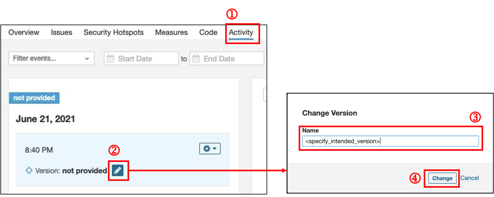
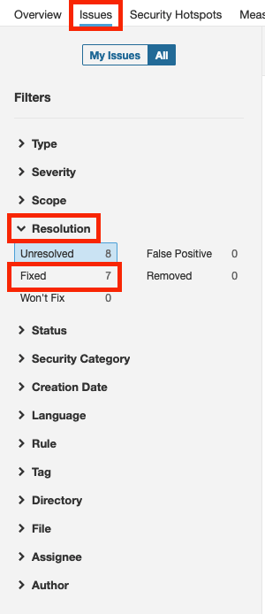
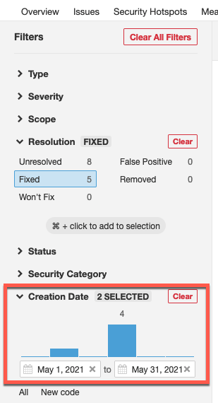

# Configure Settings

**Topics**
- [Include versioning](#include-versioning)
- [Rename untagged analysis](#rename-untagged-analysis)
- [Configure code dettings](#configure-code-settings)
- [Filter issues](#filter-issues)

## Include versioning

This section is for project teams that are looking to compare the analysis from a particular date or version against the latest scan.

### Prerequisites
- Make sure that you are an Administrator of the SonarQube project.

### To include versioning for your analysis
- In your CICD pipeline, include `-Dsonar.projectVersion <version>` into the `sonar-scanner` command.  

For more information on setting up SonarQube for your CICD pipeline, refer to the setup guide.

## Rename untagged analysis
### To rename an untagged analysis

1. Go to your [SonarQube](https://sonar.hats.stack.gov.sg/) project, and then click the **Activity** tab.
1. Navigate to the analysis that you want to rename, and then click the pencil icon to edit the version tag.
1. In the **Name** field, specify the version name. 
1. Click **Change** to apply the changes.

    <kbd></kbd>

## Configure code settings
### To configure new code settings

>**Note:** By default, New Code is defined to be based on the analysis following the previous version or analysis.

1.	Click **Project Settings** > **New Code**. 
1.	Select **Define a specific setting for this project**.
1.	Based on your requirement, select one of the following options:
    - **Number of days** 
    - **Specific analysis**   
    For this documentation, we are using the option **Specific analysis**.
1.	In the **Analysis from** dropdown, click to select an option of your choice. By default, **Last 30 days** is selected. 

    <kbd></kbd>

## Filter issues

- To access unresolved issues, click **Resolution**. 
- To access resolved issues (for example, bug, vulnerability, code smell, etc.), under the **Resolution** dropdown, click **Fixed**.

  <kbd></kbd>

- If you want to filter issues based specific date range, under the **Creation Date** section, select the required start and end date.

  <kbd></kbd>

