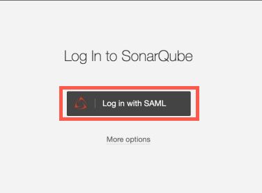

# Log in

### To log in to SonarQube  

1. Go to [SonarQube](https://sonar.hats.stack.gov.sg/sonar).
1. Click **Log in with SAML**.

    

    If you have not logged into your TechPass, you will be prompted to sign in. For more details, refer to the [TechPass user guide](https://docs.developer.tech.gov.sg/docs/techpass-user-guide/#/) if you are logging in to TechPass for the first time.
1. Authenticate and approve your TechPass login using your Microsoft authenticator app with your SG Govt M365 profile. 
1. After you have authenticated, you will be redirected to your SonarQube dashboard.