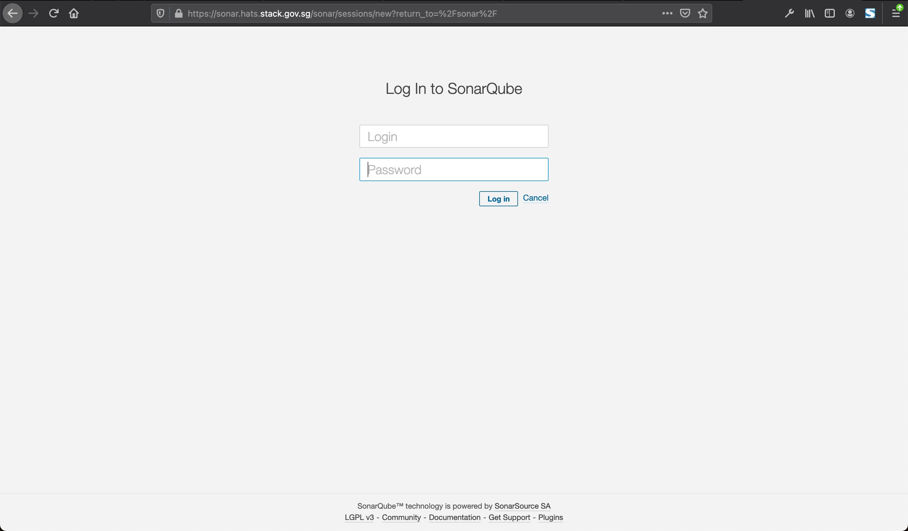
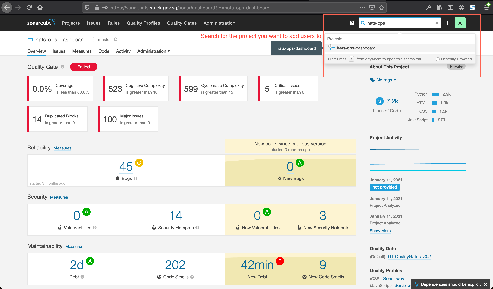
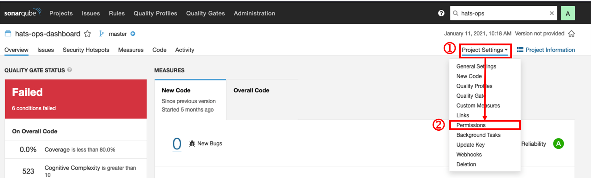
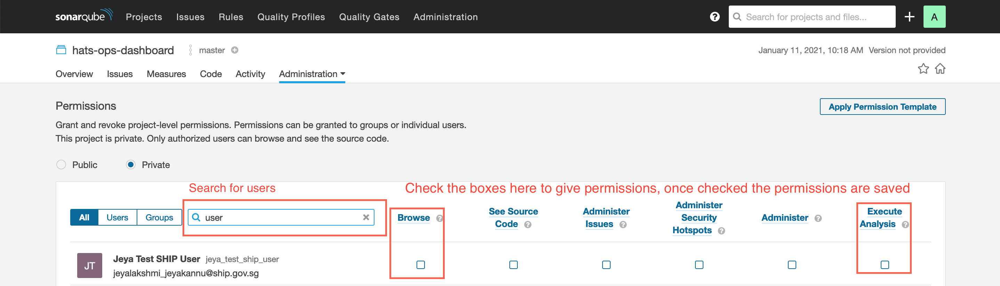

# Manage Users

### Prerequisites

- Make sure that the user to be added must have logged in once to SonarQube to auto-create the account  
    or
- Make sure that new user was invited through SHIP-HATS Portal so that the SonarQube account is auto-created.

### To manage users in a SonarQube app

1. Log in to [SonarQube](https://sonar.hats.stack.gov.sg/sonar) as a Project Admin (PA).  

    <kbd></kbd>

1. Search for the application and click to manage it.

    <kbd></kbd>
1. Navigate to **Project Settings** > **Permissions**.

    <kbd>

1. Give users permissions on individual apps.  
    >**Tip:** You can click the ? icon to see what each permission allow the user to do.

    <kbd>