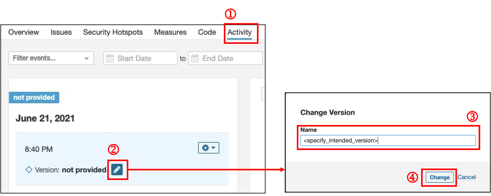

# SonarQube Self Help Guide

**Topics**
- [Create Quality Gates and Profiles](#create-quality-gates-and-profiles)
- [Manage Users](#manage-users)
- [Configure New Code Setting and Versioning](#configure-new-code-setting-and-versioning)
- [FAQs](#faqs)
- [Additional Resources](#additional-resources)

## Create Quality Gates and Profiles

### To create a customized quality gate and profile:

>**Note:** Customized profiles are not following the standards set by the CTMO team in GovTech. Therefore, Agency will need to understand the risks and quality differences set by the new customized Quality gates.

1. Raise a ticket
[here](https://jira.ship.gov.sg/servicedesk/customer/portal/11/create/149). Provide the following details:  
    a.  Quality Gate Name

    b. Quality Gate Metrics requirements (refer to [Section 2](#CreatingcustomizedQualityGatesandProfil) below)

    c. Applications to assign gates to

    d. Project Owner name and Agency name to seek approval from

2. After the Agency or Project Owner approves, we will create the gates and assign to the applications.

### An example of metrics required 

<kbd></kbd>

### Sample metric tables

You can copy the content from the following tables (**Conditions on New Code** & **Conditions on Overall Code**) when raising service requests. You can customize the metrics by: 
-  Removing the rows for **metrics** that are not required
- Updating the **value** to a value of your choice.

**Conditions on New Code**

| **Metric_id** | **Metric** | **Operator** |  **Value** |  
| --- | --- | --- | --- |  
| new_technical_debt | Added Technical Debt | is greater than | 1min |  
| new_branch_coverage	 | Condition Coverage	| is less than | 2.00% | 
| new_conditions_to_cover	|Conditions to Cover|	is greater than	|3|
new_coverage|	Coverage|	is less than|	4.00%
new_duplicated_blocks	|Duplicated Blocks|	is greater than	|5
new_duplicated_lines_density|	Duplicated Lines (%)|	is greater than	|6.00%
new_duplicated_lines|	Duplicated Lines	|is greater than	|7
new_line_coverage	Line |Coverage	|is less than	|8.00%
new_lines_to_cover	|Lines to Cover	|is greater than	|9
new_maintainability_rating	|Maintainability Rating	|is worse than	|A
new_blocker_violations	|Blocker Issues	|is greater than	|10
new_bugs	|Bugs	|is greater than	|11
new_code_smells	|Code Smells	|is greater than	|12
new_critical_violations	|Critical Issues	|is greater than	|13
new_info_violations	|Info Issues|	is greater than	|14
new_violations	|Issues	|is greater than|	15
new_lines	|Lines	|is greater than|	16
new_major_violations	|Major Issues	|is greater than	|17
new_minor_violations	|Minor Issues|	is greater than|	18
new_vulnerabilities|	Vulnerabilities|	is greater than|	19
new_reliability_rating	|Reliability Rating	|is worse than	|B
new_reliability_remediation_effort	|Reliability Remediation Effort	| is greater than|	20min
new_security_hotspots_reviewed	|Security Remediation Effort	| is greater than|	22min
new_security_review_rating|	Security Review Rating	| is worse than|	D
new_sqale_debt_ratio	|Technical Debt Ratio	| is greater than|	23.00%
new_uncovered_conditions|	Uncovered Conditions	| is greater than|	24
new_uncovered_lines	|Uncovered Lines	| is greater than|	25

---

**Conditions on Overall Code**

| **Metric_id** | **Metric** | **Operator** | **Value** |  
| --- | --- | --- | --- |  
blocker_violations	|Blocker Issues	|is greater than|	26
bugs	|Bugs	|is greater than|	27
classes		|Classes	|is greater than|	28
code_smells		|Code Smells	|is greater than|	29
cognitive_complexity		|Cognitive Complexity	|is greater than|	30
comment_lines	|	Comment Lines	|is less than|	31
comment_lines_density	|	Comments (%)	|is less than|	32.00%
branch_coverage		|Condition Coverage	|is less than|	33.00%
conditions_to_cover	|	Conditions to Cover	|is greater than|	34
confirmed_issues	|	Confirmed Issues	|is greater than|	35
coverage		|Coverage	|is less than|	36.00%
critical_violations		|Critical |issues	|is greater than|	37
complexity	|	Cyclomatic Complexity	|is greater than|	38
directories	|	Directories	|is greater than|	39
duplicated_blocks	|	Duplicated Blocks	|is greater than|	40
duplicated_files	|	Duplicated Files	|is greater than|	41
duplicated_lines	|	Duplicated Lines	|is greater than|	42
duplicated_lines_density	|	Duplicated Lines (%)	|is greater than|	43.00%
effort_to_reach_maintainability_rating_a		|Effort to Reach Maintainability Rating A	|is greater than|	44min
false_positive_issues		|False Positive Issues	|is greater than|	45
files		|Files	|is greater than|	46
functions		|Functions	|is greater than|	47
generated_lines		|Generated Lines	|is greater than|	48
generated_ncloc		|Generated Lines of Code	|is greater than|	49
info_violations		|Info Issues	|is greater than|	50
violations	|Issues	|is greater than|	51
line_coverage		|Line Coverage	|is less than|	52.00%
lines		|Lines	|is greater than|	53
ncloc		|Lines of Code	|is greater than|	54
lines_to_cover	|	Lines to Cover	|is greater than|	55
sqale_rating	|	Maintainability Rating	|is worse than|	A
major_violations	|	Major Issues	|is greater than|	56
minor_violations	|	Minor Issues	|is greater than|	57
open_issues		|Open Issues	|is greater than|	58
projects	|	Project branches	|is greater than|	59
reliability_rating	|	Reliability Rating	|is worse than|	B
reliability_remediation_effort	|	Reliability Remediation Effort	|is greater than|	1h
reopened_issues	|	Reopened issues	|is greater than|	61
security_hotspots_reviewed	|	Security Hotspots Reviewed	|is less than|	62.00%
security_rating		|Security Rating	|is worse than|	C
security_remediation_effort	|	Security Remediation Effort	|is greater than|	1h 3min
security_review_rating	|	Security Review Rating	|is worse than|	D
skipped_tests	|	Skipped Unit Tests	|is greater than|	64
statements	|	Statements	|is greater than|	65
sqale_index		|Technical Debt	|is greater than|	1h 6min
sqale_debt_ratio	|	Technical Debt Ratio	|is greater than|	67.00%
uncovered_conditions	|	Uncovered Conditions	|is greater than|	68
uncovered_lines		|Uncovered Lines	|is greater than|	69
test_execution_time	|	Unit Test Duration	|is greater than|	70ms
test_errors	|	Unit Test Errors	|is greater than|	71
test_failures	|	Unit Test Failures	|is greater than|	72
test_success_density	|	Unit Test Success (%)	|is less than|	73.00%
tests		|Unit Tests	|is less than|	74
vulnerabilities	|	Vulnerabilities	|is greater than|	75
wont_fix_issues	|	Won't Fix issues	|is greater than|	76

## Manage Users

### Prerequisites

- Make sure that the user to be added must have logged in once to SonarQube to auto-create the account  
    or
- Make sure that new user was invited through SHIP-HATS Portal so that the SonarQube account is auto-created.

### To manage users in a SonarQube app:

1. Log in to [SonarQube](https://sonar.hats.stack.gov.sg/sonar) as a Project Admin (PA).  

    <kbd></kbd>

1. Search for the application and click to manage it.

    <kbd></kbd>
1. Navigate to **Project Settings** > **Permissions**.

    <kbd>

1. Give users permissions on individual apps.  
    >**Tip:** You can click the ? icon to see what each permission allow the user to do.

    <kbd>

## Configure New Code Setting and Versioning

This section is for project teams that are looking to compare the analysis from a particular date or version against the latest scan.

### Prerequisites
- Make sure that you are an Administrator of the SonarQube project.

### To include versioning for your analysis:
- In your CICD pipeline, include `-Dsonar.projectVersion <version>` into the `sonar-scanner` command.  

For more information on setting up SonarQube for your CICD pipeline, refer to the setup guide.

### To rename an untagged analysis:

1. Go to your [SonarQube](https://sonar.hats.stack.gov.sg/) project, and then click the **Activity** tab.
1. Navigate to the analysis that you want to rename, and then click the pencil icon to edit the version tag.
1. In the **Name** field, specify the version name. 
1. Click **Change** to apply the changes.

    <kbd></kbd>

### To configure New Code setting:

>**Note:** By default, New Code is defined to be based on the analysis following the previous version or analysis.

1.	Click **Project Settings** > **New Code**. 
1.	Select **Define a specific setting for this project**.
1.	Based on your requirement, select one of the following options:
    - **Number of days** 
    - **Specific analysis**   
    For this documentation, we are using the option **Specific analysis**.
1.	In the **Analysis from** dropdown, click to select an option of your choice. By default, **Last 30 days** is selected. 

    <kbd></kbd>

### To filter issues:

- To access unresolved issues, click **Resolution**. 
- To access resolved issues (for example, bug, vulnerability, code smell, etc.), under the **Resolution** dropdown, click **Fixed**.

  <kbd></kbd>

- If you want to filter issues based specific date range, under the **Creation Date** section, select the required start and end date.

  <kbd></kbd>

## FAQs

  
<b>What are the 15 supported languages?</b>
 

Java, JavaScript, C#, TypeScript, Kotlin, Ruby, Go, Scala, Flex, Python, PHP, HTML, CSS, XML, VB.NET.
Do take note that there is no restriction of lines of code and number of applications.

  

 

  
<b>Based on SonarQube’s add-ons, what are the 7 others supported languages?</b>
 

C, C++, Obj-C, Swift, ABAP, T-SQL, PL/SQL are supported. Public officers can refer to the <a href="https://sgdcs.sgnet.gov.sg/sites/IDA-GoSync/gdspdd-ai/ship/_layouts/15/start.aspx#/SitePages/Pricing.aspx">pricing</a> for the add-ons.

  

 

  
<b>Are COTS (commercial off-the-shelf) products supported on SonarQube?</b>
 

Yes. SonarQube can scan for any customisation that the COTS product supports.
Example: Configuration files in XML or Javascript/ Java or plugins written in Java or Python.
  

 
Refer to this section if you have previously been assigned permissions in SonarQube via groups and have lost your access. 

<b>My SonarQube Projects are not appearing</b>

 

During the month of June 2021, we have implemented LDAP group support in SonarQube. Due to this change, the user membership from the <a href="https://www.ship.gov.sg">SHIP-HATS portal</a> will be automatically synced in SonarQube based on your SHIP-HATS subscription. If your subscription contains 20 users, all 20 users should be able to access SonarQube without the SA having to raise a service request to manage users in SonarQube.

We are able to do this because each SHIP-HATS subscription has a master LDAP group containing all the members of the subscription. Depending on whether you already have a group in SonarQube, we will create or rename your existing group name for it to be automatically synchronized in SonarQube. However, any groups created in SonarQube previously might not work as intended since it is not created in SHIP LDAP and will lead to unnsuccessful sync, causing the users in the group to lose access to their projects.

<b>To fix this issue:</b>

- Raise a [service request on JIRA](https://jira.ship.gov.sg) and let us know about this issue.  
We will manually find your master LDAP group and create or rename your existing SonarQube group if any. After this is done, user will be automatically be reassigned to the SonarQube projects that they had access to previously.

<b>How do we manage users in Sonarqube moving forward?</b>

 
<b>To manage users within your subscription:</b>  
 
<ol><li>The Subscription Admin (SA) and Project Admin (PA) can log in to the <a href="https://www.ship.gov.sg">SHIP-HATS portal</a>.</li>
<li>Add or remove members under the subscription.   
The user membership will be synced to the master LDAP group created for you and will be synced to the SonarQube group.</li></ol>

## Additional Resources

- [SonarQube Documentation](https://docs.sonarqube.org/latest/)
- [Cognitive Complexity - SonarSource](https://www.sonarsource.com/docs/CognitiveComplexity.pdf)