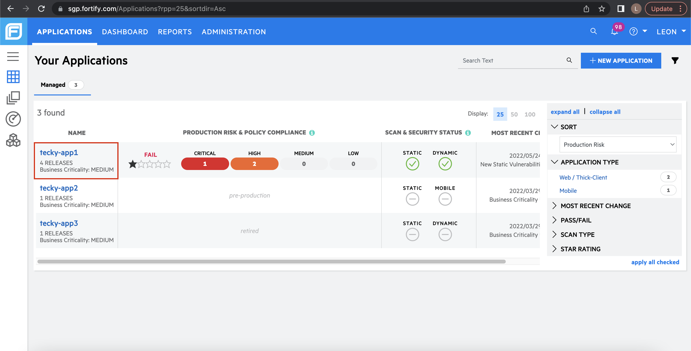
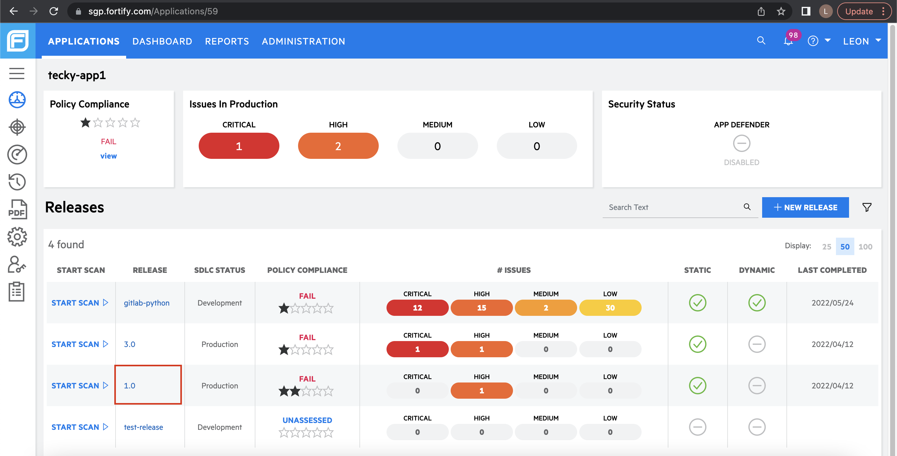
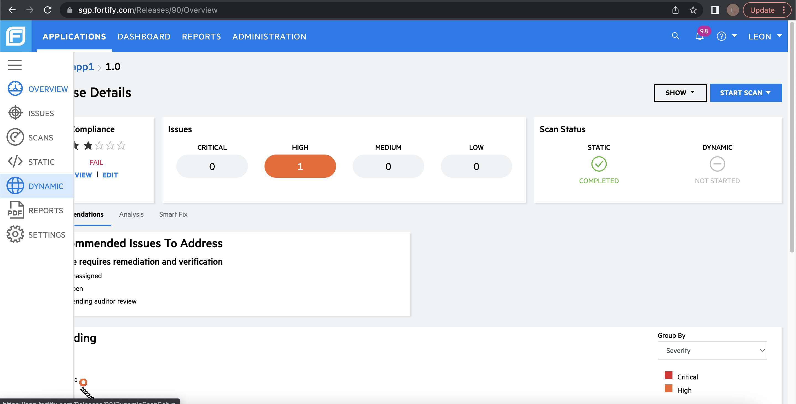
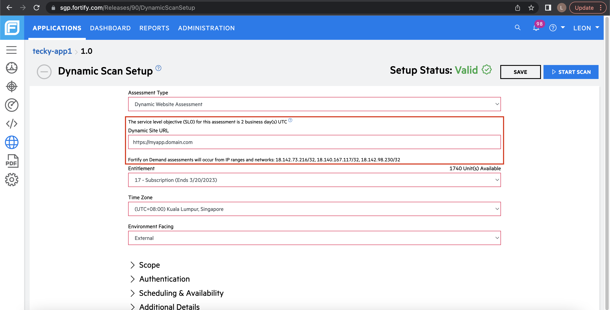
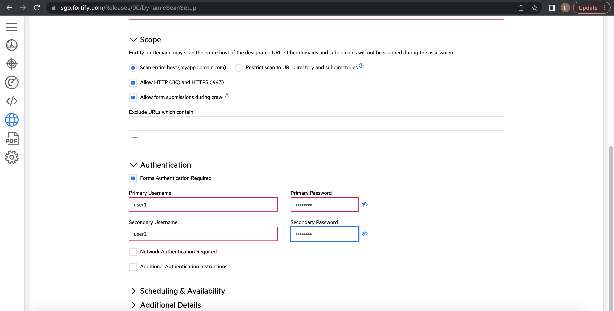
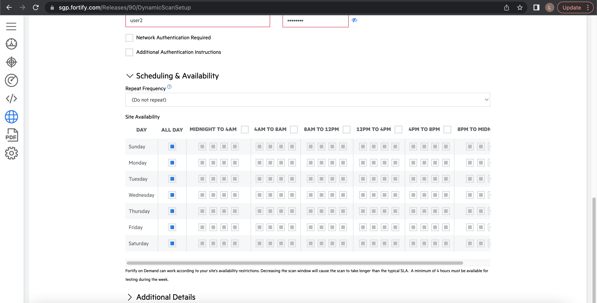
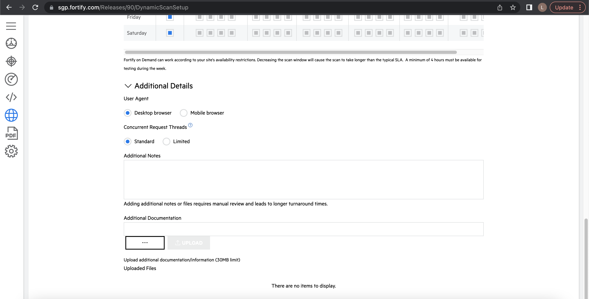
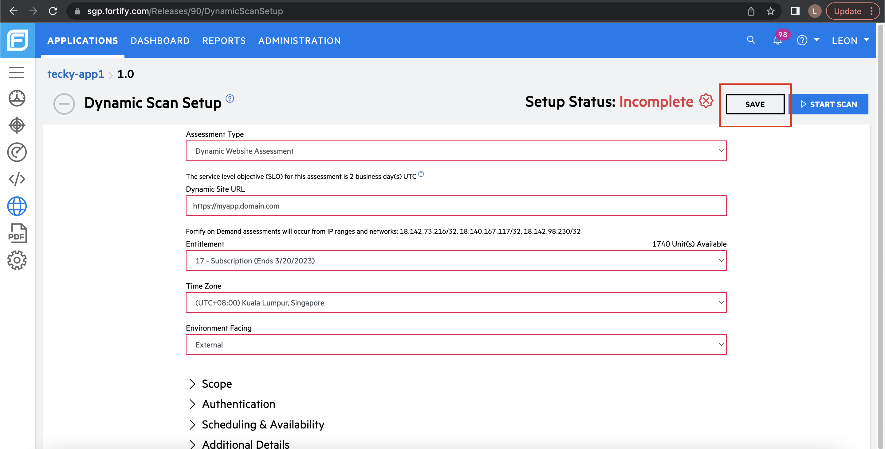
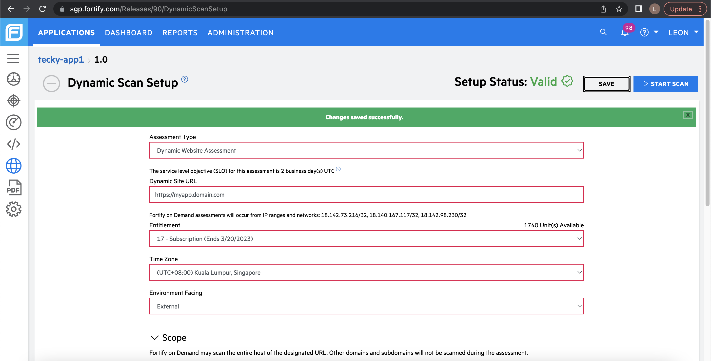

# DAST Scan

Complete the following steps to conduct a DAST scan:

1. [Set up your DAST scan in FOD portal](#set-up-your-dast-scan-in-fod-portal)
1. [Run your DAST scan in Gitlab](#run-your-dast-scan-in-gitlab)
1. [Generate DAST report on Gitlab](#generate-dast-report-on-gitlab)

## Set up your DAST scan in FOD portal
Tenants are required to setup their DAST scan once in the [FOD Portal](https://www.sgp.fortify.com/) before running their DAST scan.

1. Log in to the [FOD Portal](https://www.sgp.fortify.com/), and then click application of your choice. For this example, we are using *tecky-app1*.

2. You should be able to see at least one release in your application since the SHIP-HATS portal would have created the default 1.0 release for you. For this example, we will be using the 1.0 release.

3. Open the menu button on your left and select Dynamic to start configuring your DAST scan.

4. You should see that some of the fields are already pre-filled, you do not need to change those. You simply have to fill in the Dynamic Site URL which is the IP/DNS name of your application. Do note that your application should be public facing and you should whitelist the following IP ranges 18.142.73.216/32, 18.140.167.117/32, 18.142.98.230/32

5. Under Scope, you can choose to restrict your scan to a few URL directories but for this example we are going to scan the entire host. We will not be looking to exclude any URL either. Under Authentication, two sets of credentials are required if your web app is protected by a login page. Previously in Fortify, we had to create a login macro using a Windows tool. Do note that we no longer need to do so.

6. For Scheduling & Availability, you are able to set the Repeat Frequency, where you can configure how often the DAST scan should occur. Site availability allows you to configure your site's uptime so that the DAST scan will only occur during the times you specify.

However, we strongly recommend you keep your pre-filled values.

- Instead of setting an interval for the repeat frequency, we recommend to use the CI way to trigger the DAST scan on demand.
- For site availability, we also recommend that you do not change the values since it will unnecessarily increase the scan times in an event where your site is unavailable when the DAST scan is ready to scan your application.

7. Lastly, you have an option to change the User agent and Concurrent Request Threads, as well as upload additional documentation to provide a customized use case of your scan. As usual, we recommend you keep the pre-filled values as they are, unless you have a very specific use case to use a mobile browser.

8. Once you are done, go ahead and scroll to the top to save your DAST setup.

9. You should see that your Setup Status is now Valid and changes are saved successfully. You are now ready to invoke your DAST scan via Gitlab.

## Run your DAST scan in Gitlab

Once you have completed step 2 and setup your DAST scan in FOD, you can go ahead and start scanning in Gitlab.

Please use this [Gitlab template](https://gts.gitlab-dedicated.systems/templates/ship-hats-templates/-/blob/main/templates/.gitlab-ci-run-fod-dast.yml) to perform your scan.

It performs three essential steps to run your scan successfully.

- Get API token to invoke scan
- Get assessment ID from your DAST scan template which was setup in step 2
- Run scan using predefined and custom variables

> **Note:** FOD DAST scans are asynchronous. That means that the CI job will only queue the scan to the existing scan queue, it will take some time before the scan result is returned. Please refer to the [FOD SLO](fod-slo) for more information.

For more information, refer to the Gitlab template guide: https://gts.gitlab-dedicated.systems/templates/ship-hats-templates/-/tree/main/templates#file-gitlab-ci-run-fod-dastyml

Refer to the sample log of what you will see for a successful pipeline: https://gts.gitlab-dedicated.systems/templates/ship-hats-templates/-/jobs/42363

## Generate DAST report on Gitlab

It is recommended to perform a manual review on the issues found from the DAST scan before generating a DAST report on Gitlab. This is to ensure that no False Positive (FP) appears in the Gitlab Vulnerability Dashboard.

For information on how to reuse the template, refer to the Gitlab template guide here: https://gts.gitlab-dedicated.systems/templates/ship-hats-templates/-/tree/main/templates#file-gitlab-ci-create-fod-reportyml

## DAST Limitations

There are some constraints on FOD which tenants should take note of when configuring and running DAST scans.

Dynamic Site URL, Scope and Authentication values of the DAST setup cannot be changed once a DAST scan is started on a release.	
Previously in WIE, users are able to whitelist site URLs and start new scans with different whitelisted URLs. Users are also able to use different login macros.

FOD does not allow the change in the URL once a scan has started. It does not allow the user credentials configured to be changed as well.

Doublecheck whether the URL is valid before starting a DAST scan.

Users are also strongly recommended to use DNS names instead of IP to scan their app as IPs might change, causing the DAST scan to fail since the app is no longer hosted on that IP.

In the worst case scenario, users will have to delete the release and recreate in order to create a new DAST setup.

For each application in FOD, only one DAST scan can be performed at any time	
Previously in WIE, users are able to trigger multiple DAST scans which are queued and handled based on the availability of sensors hosted in the SHIP-HATS environment.

FOD does not allow new DAST scans to be triggered on an application release, if there is an existing scan that is running on another release of the same application.

For example, if application A has 2 releases (1.0 and 2.0). A DAST scan cannot be triggered on release 2.0 if there is an existing scan running on release 1.0. This does not affect releases from different applications, meaning that release 1.0 of application B can will proceed to scan even if application A already has a scan running.

Use CI to control when your scans are conducted. Do not schedule your scan as mentioned in Step 6 of Setting up your DAST scan in FOD portal

For projects with multiple applications, we strongly recommend that you create one FOD application per web app to prevent this issue from affecting your release management.

DAST scans might take more than 1 day when the first scan is invoked	
The first DAST scan of each release is manually audited by the SaaS operations team. This might significantly increase the scan times when your first scan is invoked.

Future scans should not take more than a few hours, based on the complexity of your application

