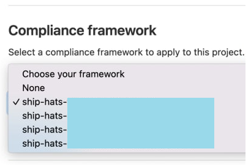

# Security Compliance - Configurations/Templates

We strongly recommend use of Compliance templates provided as part of Compliance framework for the projects.

The Compliance Framework Templates have been named as such **ship-hats-xxxxx**. 

Using SHIP-HATS compliance templates, you can assure that your pipeline includes:
- Good secure pipeline practices 
- Apply most of the necessary scans and checks

> **Note:** Agency that chooses to use its own configurations/templates will be required to have its own risk assessment, and to be consulted by their ACISO and MCISO.

### Sample Compliance Framework

