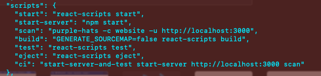
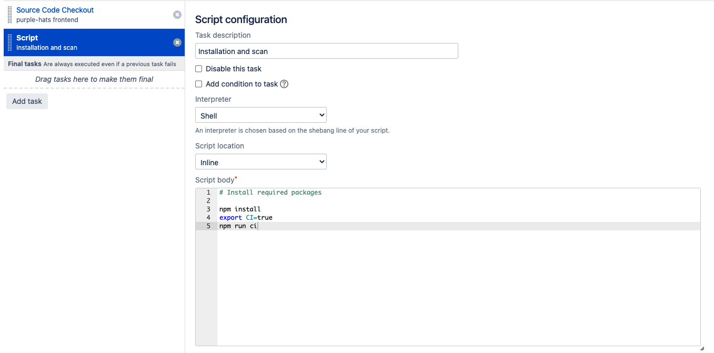

# Run scans

### To run scans on local web projects

1. Checkout your website project in the pipeline. 
    - For NPM, you can use `start-server-and-test`. 
    - For other package manager, you may need to find an equivalent packages performing the same function.
1. Include the following NPM script name in your `package.json`. In this case:
    - The NPM script name, `scan`, has been defined in the `package.json` with the Purple HATS CLI command. 
    - The `ci` NPM script name is defined to be used in the pipeline.
    - In this walkthrough, a React project is being used to perform a website scan.

        
1. In your Bamboo build plan, add `export CI=true` into the Script task. 
    
    This will ensure that the `start-server-and-test` (or equivalent) tool is able to run in the pipeline before running the NPM scripts.  

    <kbd>