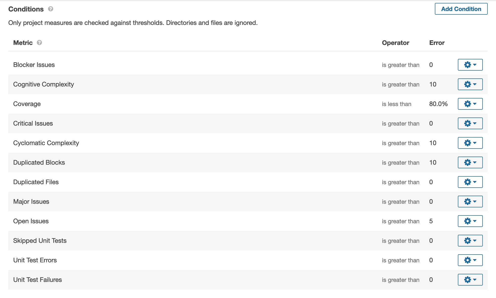

# Create quality gates and profiles

**Topics**
- [Create quality gate](#create-quality-gate)
- [Sample metric tables](#sample-metric-tables)

## Create quality gate

### To create a customized quality gate and profile

>**Note:** Customized profiles are not following the standards set by the CTMO team in GovTech. Therefore, Agency will need to understand the risks and quality differences set by the new customized Quality gates.

1. [Raise a ticket](https://jira.ship.gov.sg/servicedesk/customer/portal/11/create/149). Provide the following details:  
    - Quality Gate Name
    - Quality Gate Metrics requirements (refer to [Section 2](#CreatingcustomizedQualityGatesandProfil) below)
    - Applications to assign gates to
    - Project Owner name and Agency name to seek approval from

1. After the Agency or Project Owner approves, we will create the gates and assign to the applications.

### An example of metrics required 

<kbd></kbd>

## Sample metric tables

You can copy the content from the following tables (**Conditions on New Code** & **Conditions on Overall Code**) when raising service requests. You can customize the metrics by: 
-  Removing the rows for **metrics** that are not required
- Updating the **value** to a value of your choice.

### Conditions on New Code

| **Metric_id** | **Metric** | **Operator** |  **Value** |  
| --- | --- | --- | --- |  
| new_technical_debt | Added Technical Debt | is greater than | 1min |  
| new_branch_coverage	 | Condition Coverage	| is less than | 2.00% | 
| new_conditions_to_cover	|Conditions to Cover|	is greater than	|3|
new_coverage|	Coverage|	is less than|	4.00%
new_duplicated_blocks	|Duplicated Blocks|	is greater than	|5
new_duplicated_lines_density|	Duplicated Lines (%)|	is greater than	|6.00%
new_duplicated_lines|	Duplicated Lines	|is greater than	|7
new_line_coverage	Line |Coverage	|is less than	|8.00%
new_lines_to_cover	|Lines to Cover	|is greater than	|9
new_maintainability_rating	|Maintainability Rating	|is worse than	|A
new_blocker_violations	|Blocker Issues	|is greater than	|10
new_bugs	|Bugs	|is greater than	|11
new_code_smells	|Code Smells	|is greater than	|12
new_critical_violations	|Critical Issues	|is greater than	|13
new_info_violations	|Info Issues|	is greater than	|14
new_violations	|Issues	|is greater than|	15
new_lines	|Lines	|is greater than|	16
new_major_violations	|Major Issues	|is greater than	|17
new_minor_violations	|Minor Issues|	is greater than|	18
new_vulnerabilities|	Vulnerabilities|	is greater than|	19
new_reliability_rating	|Reliability Rating	|is worse than	|B
new_reliability_remediation_effort	|Reliability Remediation Effort	| is greater than|	20min
new_security_hotspots_reviewed	|Security Remediation Effort	| is greater than|	22min
new_security_review_rating|	Security Review Rating	| is worse than|	D
new_sqale_debt_ratio	|Technical Debt Ratio	| is greater than|	23.00%
new_uncovered_conditions|	Uncovered Conditions	| is greater than|	24
new_uncovered_lines	|Uncovered Lines	| is greater than|	25

---

### Conditions on Overall Code

| **Metric_id** | **Metric** | **Operator** | **Value** |  
| --- | --- | --- | --- |  
blocker_violations	|Blocker Issues	|is greater than|	26
bugs	|Bugs	|is greater than|	27
classes		|Classes	|is greater than|	28
code_smells		|Code Smells	|is greater than|	29
cognitive_complexity		|Cognitive Complexity	|is greater than|	30
comment_lines	|	Comment Lines	|is less than|	31
comment_lines_density	|	Comments (%)	|is less than|	32.00%
branch_coverage		|Condition Coverage	|is less than|	33.00%
conditions_to_cover	|	Conditions to Cover	|is greater than|	34
confirmed_issues	|	Confirmed Issues	|is greater than|	35
coverage		|Coverage	|is less than|	36.00%
critical_violations		|Critical |issues	|is greater than|	37
complexity	|	Cyclomatic Complexity	|is greater than|	38
directories	|	Directories	|is greater than|	39
duplicated_blocks	|	Duplicated Blocks	|is greater than|	40
duplicated_files	|	Duplicated Files	|is greater than|	41
duplicated_lines	|	Duplicated Lines	|is greater than|	42
duplicated_lines_density	|	Duplicated Lines (%)	|is greater than|	43.00%
effort_to_reach_maintainability_rating_a		|Effort to Reach Maintainability Rating A	|is greater than|	44min
false_positive_issues		|False Positive Issues	|is greater than|	45
files		|Files	|is greater than|	46
functions		|Functions	|is greater than|	47
generated_lines		|Generated Lines	|is greater than|	48
generated_ncloc		|Generated Lines of Code	|is greater than|	49
info_violations		|Info Issues	|is greater than|	50
violations	|Issues	|is greater than|	51
line_coverage		|Line Coverage	|is less than|	52.00%
lines		|Lines	|is greater than|	53
ncloc		|Lines of Code	|is greater than|	54
lines_to_cover	|	Lines to Cover	|is greater than|	55
sqale_rating	|	Maintainability Rating	|is worse than|	A
major_violations	|	Major Issues	|is greater than|	56
minor_violations	|	Minor Issues	|is greater than|	57
open_issues		|Open Issues	|is greater than|	58
projects	|	Project branches	|is greater than|	59
reliability_rating	|	Reliability Rating	|is worse than|	B
reliability_remediation_effort	|	Reliability Remediation Effort	|is greater than|	1h
reopened_issues	|	Reopened issues	|is greater than|	61
security_hotspots_reviewed	|	Security Hotspots Reviewed	|is less than|	62.00%
security_rating		|Security Rating	|is worse than|	C
security_remediation_effort	|	Security Remediation Effort	|is greater than|	1h 3min
security_review_rating	|	Security Review Rating	|is worse than|	D
skipped_tests	|	Skipped Unit Tests	|is greater than|	64
statements	|	Statements	|is greater than|	65
sqale_index		|Technical Debt	|is greater than|	1h 6min
sqale_debt_ratio	|	Technical Debt Ratio	|is greater than|	67.00%
uncovered_conditions	|	Uncovered Conditions	|is greater than|	68
uncovered_lines		|Uncovered Lines	|is greater than|	69
test_execution_time	|	Unit Test Duration	|is greater than|	70ms
test_errors	|	Unit Test Errors	|is greater than|	71
test_failures	|	Unit Test Failures	|is greater than|	72
test_success_density	|	Unit Test Success (%)	|is less than|	73.00%
tests		|Unit Tests	|is less than|	74
vulnerabilities	|	Vulnerabilities	|is greater than|	75
wont_fix_issues	|	Won't Fix issues	|is greater than|	76
